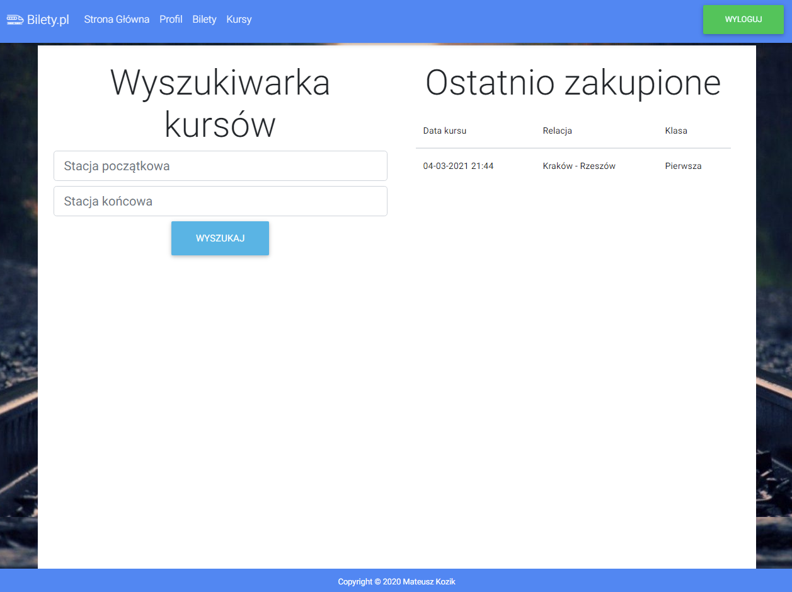

# RailwayTicketingSystem

### Railway ticketing system using: Java, SpringFramework, Thymeleaf, Spring Security and JPA

The system created in JAVA language using the Thymeleaf template engine. It has three levels of authorization: administrator, driver, and passenger.
The administrator can add new trains, routes, drivers, and ticket discounts, e.g. for students. Each train can have first-class and second-class seats.
The driver's account shows a list of the courses he will be operating.
An interface has been prepared for the user that allows them to search for train courses and purchase tickets.

